## 1.Introduction

---

To study astronomical sources from our universe, astronomers need facilities like telescopes to collect and analyze lights or radiations. The Large Synoptic Survey Telescope (LSST) is a powerful telescope that will start its main survey in 2022. It is so revolutionary as it collect much more astronomical data than other telescopes. For example, each and every week LSST will find more sources than Hubble has ever seen in its entire 28+ year life.

Roughly speaking, LSST can "see" astrophysical sources in the night sky that change in brightness over time, and these time-series of brightness (also called "light curves") will be recorded. Our data set is based on a SIMULATION of the light curves that LSST can expect to collect. 

In this project, our goal is to classify astronomical sources into different classes according to their light curves.

## 2.Exploratory data analysis

---

### Data Information

```{r,message=FALSE}
library(ggplot2)
library(dplyr)
library(forcats)
library(ggpubr)
```

```{r,echo=FALSE}
# train_meta_data = read.csv("./Data/training_set_metadata.csv")
# test_meta_data = read.csv("./Data/test_set_metadata.csv")
# train_data = read.csv("./Data/training_set.csv")
# test_data = read.csv("./Data/test_set_sample.csv")
# save(train_meta_data,test_meta_data,train_data,test_data,file = "./Data/project_data.Rdata")
```


```{r}
load("../Data/project_data.Rdata")
head(train_meta_data)
head(train_data)
```

So here we have 1421705 training data, each corresponding to a observation, and there are 7848 astronomical sources in total. Some important attributes are summarized below:

* In `train_data`:
  * `object_id`: unique index of astronomical source.
  * `mjd`: `train_data` is the time in Modified Julian Date (MJD) of the observation.
  * `flux`: the "brightness" of this source at this time.
  * `passband`: six integers from 0 to 5. Flux can be measured from these represent six filters.
* In `train_meta_data`:
  * `target`: the class of the astronomical source and there is 14 classes in total.
  * `ra,decl `: sky coordinates, represent the direction of the source.
  * `hostgal_specz`: the spectroscopic redshift of the source, represents the distance between us and the source. This is usually missing in real data, so can not be used as a feature.
  * `hostgal_photoz,hostgal_photoz_err`: estimated spectroscopic redshift and its error.


### Meta data visualization
```{r}
train_meta_data = train_meta_data %>% 
        mutate(is_extragalactic=as.logical(hostgal_specz),
               object_id =as.factor(object_id),target=as.factor(target))
id2class = train_meta_data$target
names(id2class) = train_meta_data$object_id
train_data = train_data %>% 
  mutate(object_id =as.factor(object_id),
         passband=as.factor(passband),target=id2class[object_id])
```
```{r eval=FALSE}
train_meta_data %>% ggplot() + 
  geom_bar(aes(x=target,fill=is_extragalactic),stat="count",colour="green")+
  labs(x="target class",y="count")

ggsave("./Images/img1.png")
```

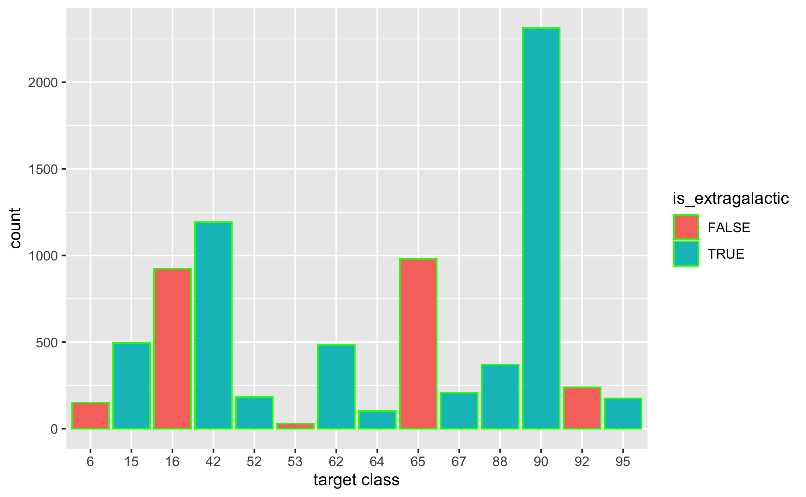{#id .class width=400 height=400}

You can see we have 14 classes and the class distribution in the training set is imbalanced. There are more than 2000 sources in class 90 but only 30 sources in class 53.

Also, there is no overlap at all between the galactic and extragalactic sources in the training set. So we may train different models for these two sets of sources.

```{r eval=FALSE}
train_meta_data %>% ggplot()+geom_point(aes(x=decl,y=ra,color=target),size = 0.5)+
  labs(x="Dec coordinate",y="Ra coordinate",color="class",title="Locations of sources")
ggsave("./Images/img2.png")
```

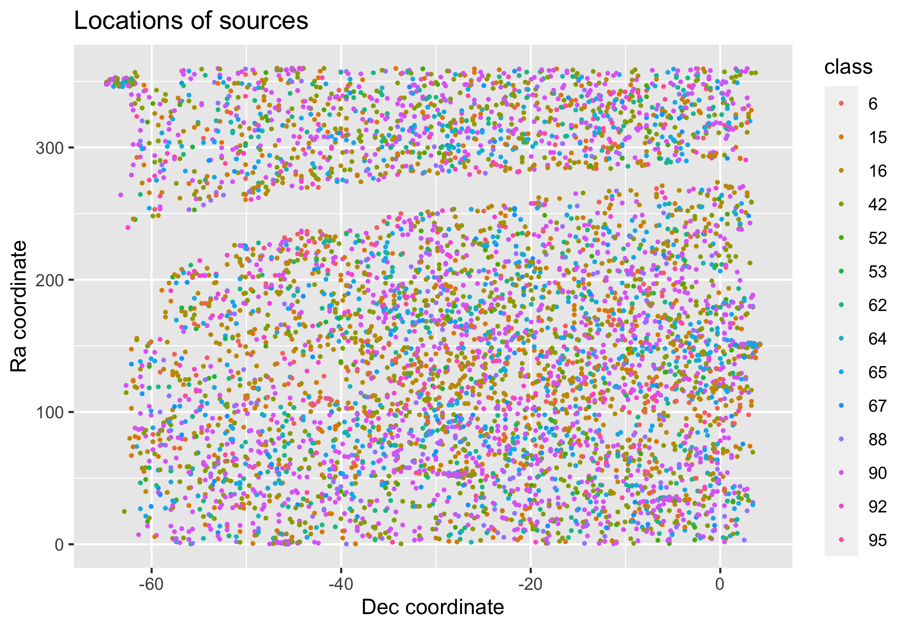{#id .class width=400 height=400}

It seems that the class distribution is not uniform in our coordinate system and thus the coordinates may help us do classification.

```{r,warning=FALSE,eval=FALSE}


p1 = ggplot(train_meta_data)+geom_point(aes(x=hostgal_photoz,y=distmod ),color="red",size=1,alpha=0.5)
p2 = ggplot(train_meta_data)+geom_point(aes(x=hostgal_specz,y=distmod ),color="red",size=1,alpha=0.5)
p3 = ggplot(train_meta_data)+
  geom_point(aes(x=hostgal_specz,y=hostgal_photoz),color="red",size=1,alpha=0.5)+
  geom_abline(aes(slope=1,intercept=0),color="lightblue",size=1)

figure <- ggarrange(p1, p2,p3,
                    labels = c("photometric redshift and distmod",
                               "spectroscopic redshift and distmod",
                               "spectroscopic and photometric redshift"),
                    ncol = 2, nrow = 2)
ggsave("./Images/img3.png")
```

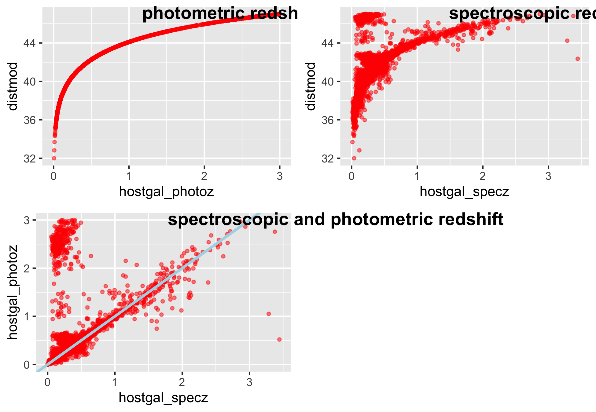{#id .class width=500 height=500}

To determine the location of a source, we need both direction and distance. However, we can see attribute `distmod` is just a transformed `hostgal_photoz`, which is the estimated "distance" and can be strongly biased from the real `hostgal_specz`.


### Training data visualization

We notice that each source can have different number of observations and observations are at different time points. In detail, some sources have more than 500 obverservitions and some sources only have less than 100 observations. Thus data  preprocessing is asked.

```{r eval=FALSE}
train_data %>% count(object_id) %>% 
  ggplot(aes(n))+geom_bar(stat="count",color="lightblue")+
  labs(x="Number of observations",y="Number of sources")
ggsave("./Images/img4.png")
```

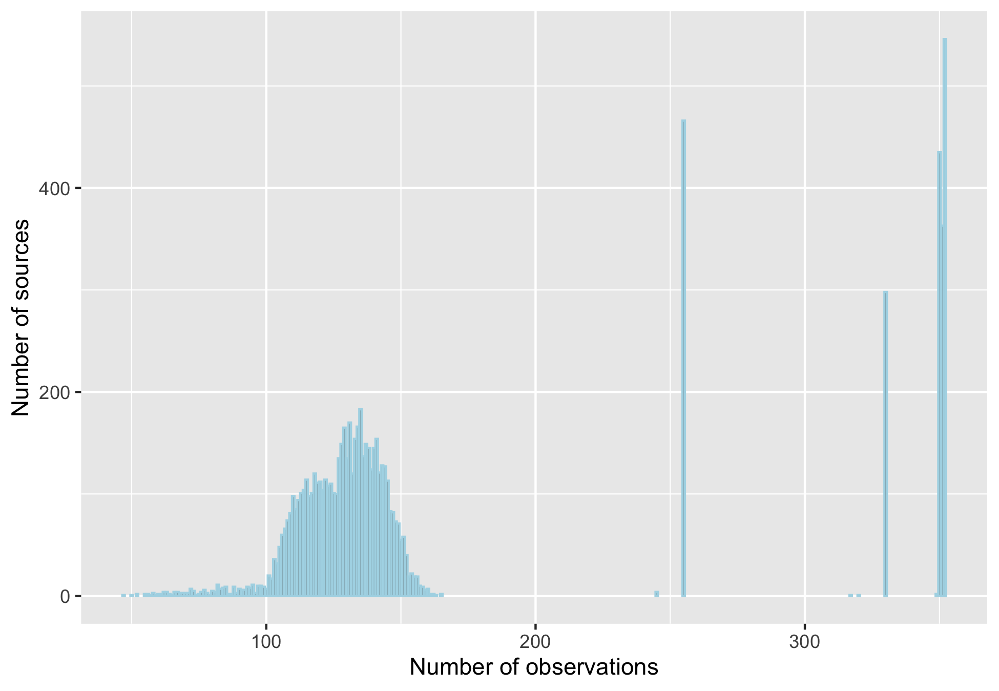{#id .class width=330 height=330}


Here, we pick up one source for each class and we draw a box plot(left) of flux for the passband 1. As there are too many outliers, we zoom in this box plot(right).
```{r,warning=FALSE,eval=FALSE}
plot_data = train_data %>% filter(passband==1) %>% group_by(target)
p1 = plot_data %>%  ggplot() + geom_boxplot(aes(x=flux,fill=target)) + labs(x="flux",fill="class")

p2 = plot_data %>% ggplot() + geom_boxplot(aes(x=flux,fill=target)) + labs(x="flux",fill="class") +scale_x_continuous(limits=c(-10,100))
figure <- ggarrange(p1, p2,ncol = 2, nrow = 1)
ggsave("./Images/img5.png")
```

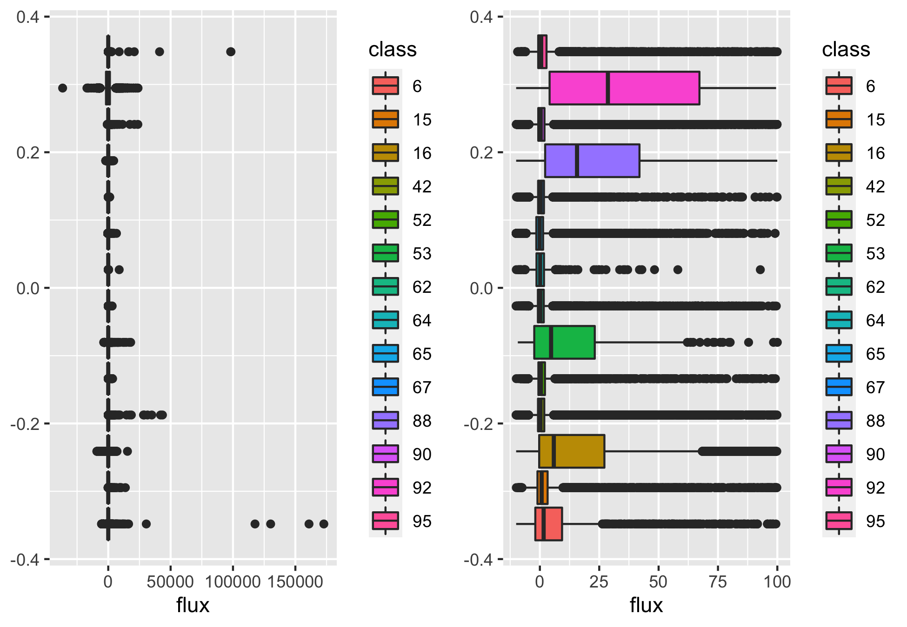{#id .class width=500 height=500}

Basically, there are two type of classes:

* classes like class 92 with large interquartile range and less outliers. They may be stars like  binary systems.
* classes like class 6 with small interquartile range and many outliers. They may be stars like supernovas.


Here we show the the light curves for some sources:

```{r eval=FALSE}
index = which(train_meta_data$target==16)[1]
object = as.integer(train_meta_data$object_id[index])
object = train_data[which(as.integer(train_data$object_id)==as.integer(object)),]
p1 = object%>% ggplot() + geom_point(aes(x=mjd,y=flux,color=passband),size=2) + geom_line(aes(x=mjd,y=flux,color=passband),size=1,alpha=0.2)
#################
index = which(train_meta_data$target==64)[1]
object = as.integer(train_meta_data$object_id[index])
object = train_data[which(as.integer(train_data$object_id)==as.integer(object)),]
p2 = object %>% ggplot() + geom_point(aes(x=mjd,y=flux,color=passband),size=2) + geom_line(aes(x=mjd,y=flux,color=passband),size=1,alpha=0.2)
##################
index = which(train_meta_data$target==88)[1]
object = as.integer(train_meta_data$object_id[index])
object = train_data[which(as.integer(train_data$object_id)==as.integer(object)),]
p3 = object %>% ggplot() + geom_point(aes(x=mjd,y=flux,color=passband),size=2) + geom_line(aes(x=mjd,y=flux,color=passband),size=1,alpha=0.2)
##################
index = which(train_meta_data$target==90)[1]
object = as.integer(train_meta_data$object_id[index])
object = train_data[which(as.integer(train_data$object_id)==as.integer(object)),]
p4 = object %>% ggplot() + geom_point(aes(x=mjd,y=flux,color=passband),size=2) + geom_line(aes(x=mjd,y=flux,color=passband),size=1,alpha=0.2)


figure <- ggarrange(p1, p2,p3,p4,
                    labels = c("A source in class 16", "A source in class 64","A source in class 88", "A source in class 90"),ncol = 2, nrow = 2)
ggsave("./Images/img6.png")
```

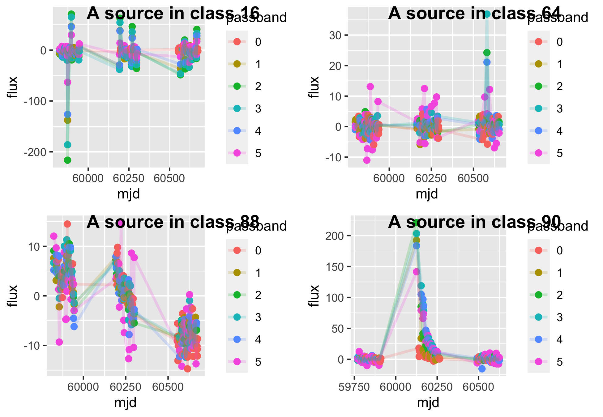{#id .class width=500 height=500}


It is natural to fit flux with models like time series or Gaussian process  as it changes with time. For example, we can fit the flux for passband 1 with Gaussian process:

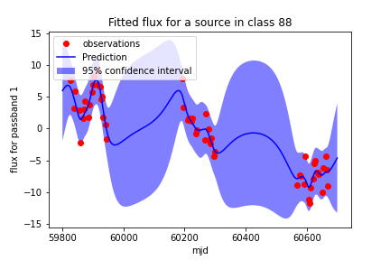{#id .class width=300 height=300} 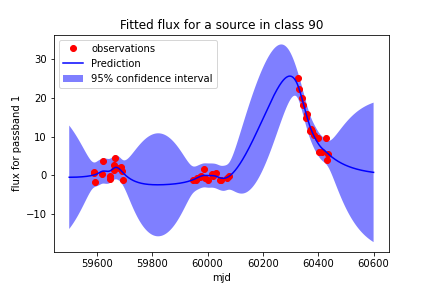{#id .class width=300 height=300}


## 3.Gaussian process modeling and data augmentation

---

Now we denote observation time `mjd` by $t$ and brightness `flux` by $f$. For the `passband`, the flux value in a passband is actually a "weighted average" of fluxes from many wavelengths. The information for passband can be found in some [additional source](https://github.com/lsst/throughputs/tree/master/baseline). We will later consider passbands as corresponding weighted average wavelengths. That is, passband 0 to 5 stands for wavelengths $l_0$ to $l_5$.

As our data are actually time series, we need to transfer them to finite-dimensional covariates.

The method we use is Gaussian process regression.

Notice flux between different passband(wavelength) are obviously correlated, the Gaussian process is defined on a two-dimensional time-wavelength space:
$$
f(\mathbf{x}) \sim \mathcal{G} \mathcal{P}\left(0, k\left(\mathbf{x}, \mathbf{x}^{\prime}\right)\right), \quad \mathbf{x} = (t,l),\mathbf{x}^{\prime} = (t^{\prime},l^{\prime})
$$

and the kernel $k\left(\mathbf{x}, \mathbf{x}^{\prime}\right)$ is choosn to be Matern covariance kernel with smoothness $1.5$:

$$
k\left(\mathbf{x}, \mathbf{x}^{\prime}\right) = \sigma^{2}\left(1+d\right) \exp \left(-d\right)+\tau^21_{\{d=0\}}, \quad d=\sqrt{\left(\frac{t-t'}{\rho_t}\right)^2+\left(\frac{l-l'}{\rho_l}\right)^2}
$$

As we only have 6 passband, it is not likely to get good estimation for $\rho_l$. We fix $\rho_l=600(nm)$ and thus model parameters are $\theta=\{\sigma^2,\tau^2,\rho_t\}$.

The parameters estimation is done by MLE, more percisely, see algorithm 2.1 from [this book](https://link.springer.com/chapter/10.1007/978-3-540-28650-9_4}{Gaussian processes in machine learning).

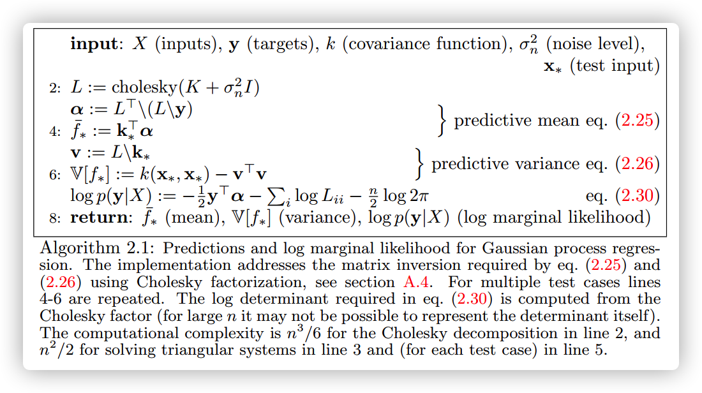{#id .class width=400 height=400}

After this, we do data augmentation by sampling from the posterior distribution at certain passband and time point.

* We only do this for passband 1,3,5 
* We choose about 300 time points for each sampled curve. 
* On average, 14 samples are drawn for each original data. In detail, for a curve in class $i$, we generate $n_i$ curves by sampling from the posterior distribution, where $n_i=\text{floor}(400/N_i)$, $N_i$ is the number of original sources in class $i$. That is, in augmented data set, each class has approximately the same number of sources.

Here are three examples of original curves(left) and sampled curves(right):

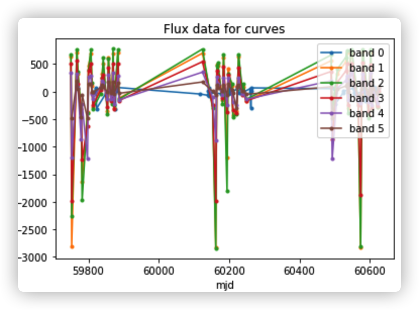{#id .class width=300 height=300} 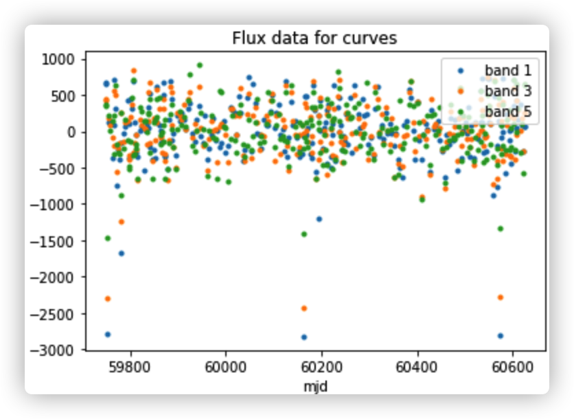{#id .class width=310 height=290}
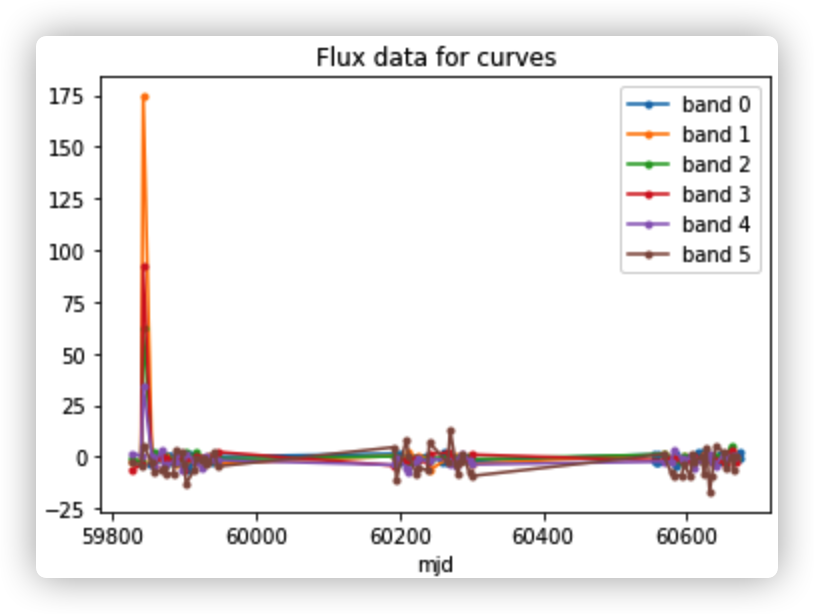{#id .class width=300 height=300}  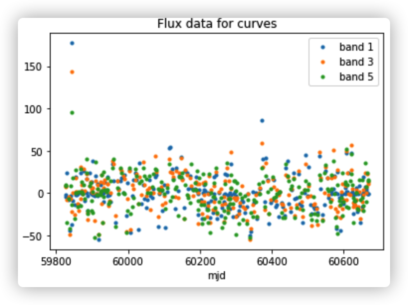{#id .class width=300 height=300}

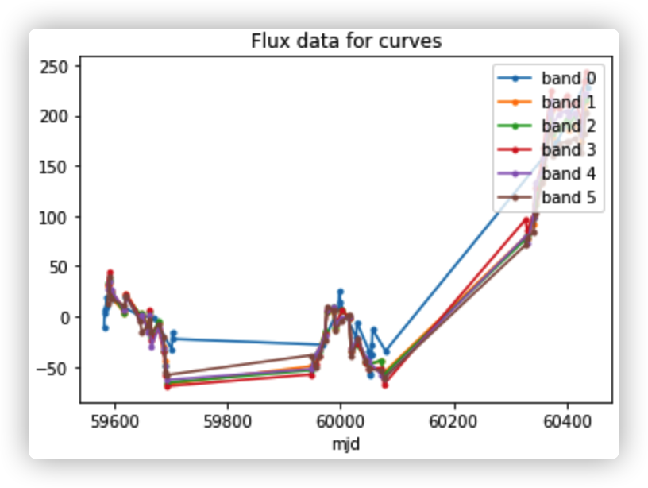{#id .class width=300 height=300}  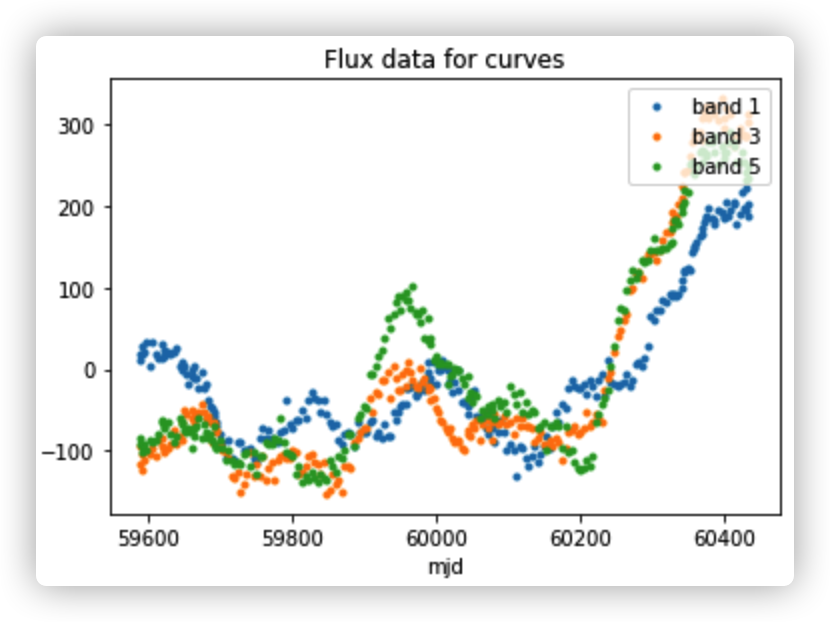{#id .class width=300 height=300}
Now for each sampled light curve, we want to extract features for further classification.

Here I consider two types of features:

1. Features directly from meta data

* `ra` and `decl`: According to the analysis in my proposal, distribution of classes are not uniform in (ra,dec) coordinate system. So using this "location" information may help us do classification.
	
* `host_photoz` and `host_photoz_err`: As mentioned before, host_photoz is a estimator of the distance between us and the target souce. This "depth" information is useful

2. Features from our sampled curve


*  `max_ratio_1,min_ratio_1,max_ratio_2,min_ratio_2`:  Maximum/minimum of relative differences between flux in band 1,3 and 3,5. These features describe the variability among passbands.
		
*  `max_flux`: Maximum flux for passband 3.
	
* `time_max_0.2,time_max_0.5`: Time difference for passband 3 between the time for maximum flux and nearest time for less than 80%/50% flux. This a measure of  period length.
*  `ratio_flux`: Ratio of the maximum to the range of flux in passband 3.
		\item  `max_t_diff`: Time difference between the time for maximum flux in band 1 and band 5.

*  	`skewness`: Skewness for flux in band 3.
*  `Kurtosis`: Kurtosis for flux in band 3.
*  `length_param`: we fitted scale parameter $\rho_t$.
*	 `skewness_g_i,Kurtosis_g_i,skewness_i_y,Kurtosis_i_y`: skewness/Kurtosis of relative relative differences between flux in band 1,3 and 3,5.

In total, we have 20 features for each generated curve.

## 4.Classification and analysis

---


I use **random forest** from python package `sklearn.ensemble` as my classifier for simplicity. There are **two random forests** separately for galactic sources and for extragalactic sources. For both random forests, the number of trees  is set to be 100. For each tree, a small depth: 30, is chosen to avoid overfitting. We find tuning these hyperparameters brings little improvement.

First I randomly select $\frac{1}{5}$ data as training and the remaining as testing data, our two random forest gives **$95.2\%$** prediction accuracy on testing data. This is a pretty high accuracy for our classification task with $14$ classes. The confusion matrices for galactic sources(left) and extragalactic sources(right) are shown below:


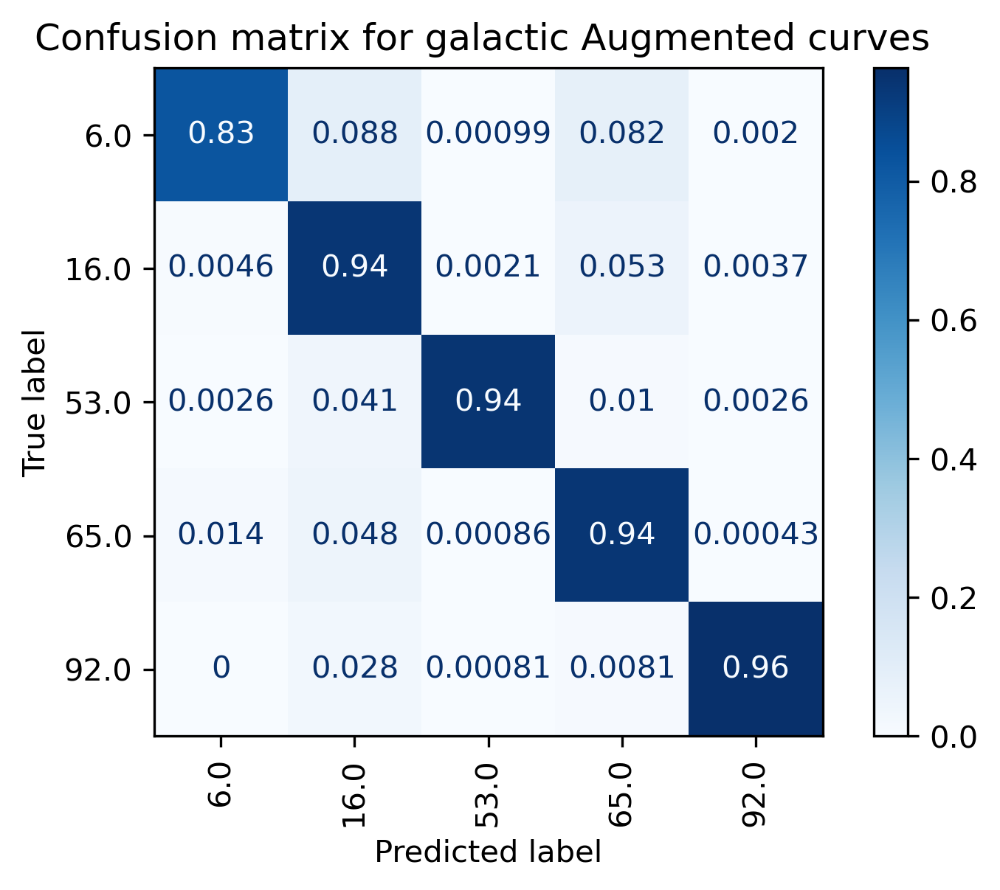{#id .class width=300 height=300}  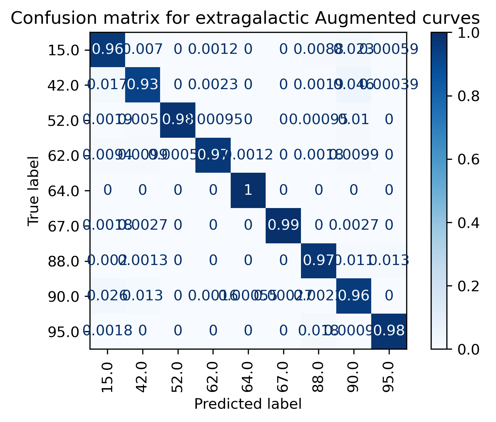{#id .class width=310 height=310}

Remember in my final presentation, classification results for class 52 and 67 are terrible and can be explained by imbalanced classes in training data. Now as each class has approximately the same number of augmented data, this problem is solved as expected. 

It is also possible to inspect the predicted probabilities for each class by calling `.predict_proba()` method in python.

Moreover, the impurity-based feature importance can be calculated to illustrate the influences of each feature(up is for galactic classifier and down is for extragalactic classifier):

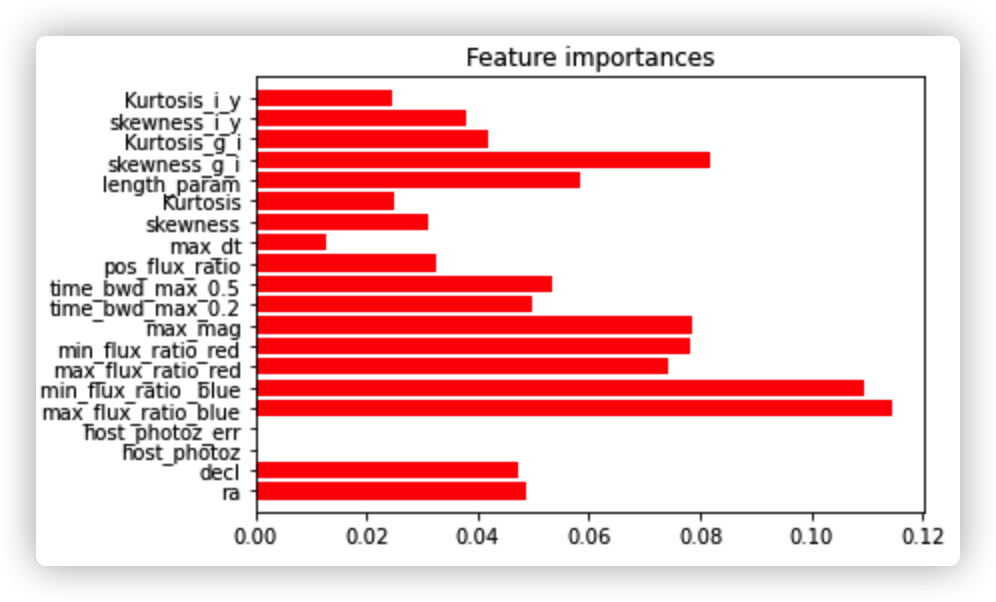{#id .class width=400 height=400} 

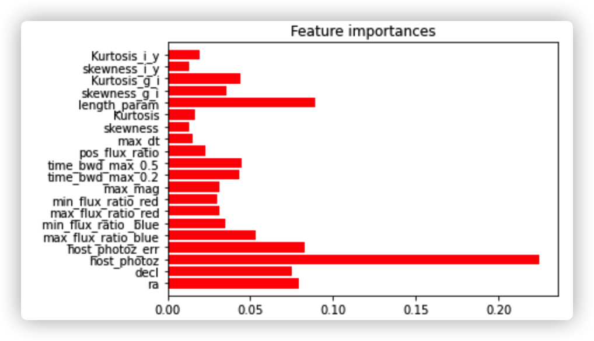{#id .class width=400 height=400}

* As expected, for extragalactic classes, the `host_photoz` plays the most important role in our classification. This can be explained as the distributions of different classes of astronomical sources are highly dependent on the their distance from us. Some astronomical sources may usually be close to us and some may only exist in the "deep part" of our universe. This re-emphasises the importance of getting accurate `host_specz` estimator, which happens to be an wildly-studied task in astronomy. 
* Features except `host_photoz` and `host_photoz_err` play similar roles in galactic and extragalactic classifications.

At the end, we use these $20\%$ augmented training data to do classification on the mean prediction(posterior means) of original curves. Now we get $81.6\%$ accuracy, which is better than what we got in final presentation($73\%$). This improvement is due to:

* Training data are "balanced" by data augmentation process.
* More features are used.

Again we show the confusion matrices below(left: galactic sources, right: extragalactic sources):
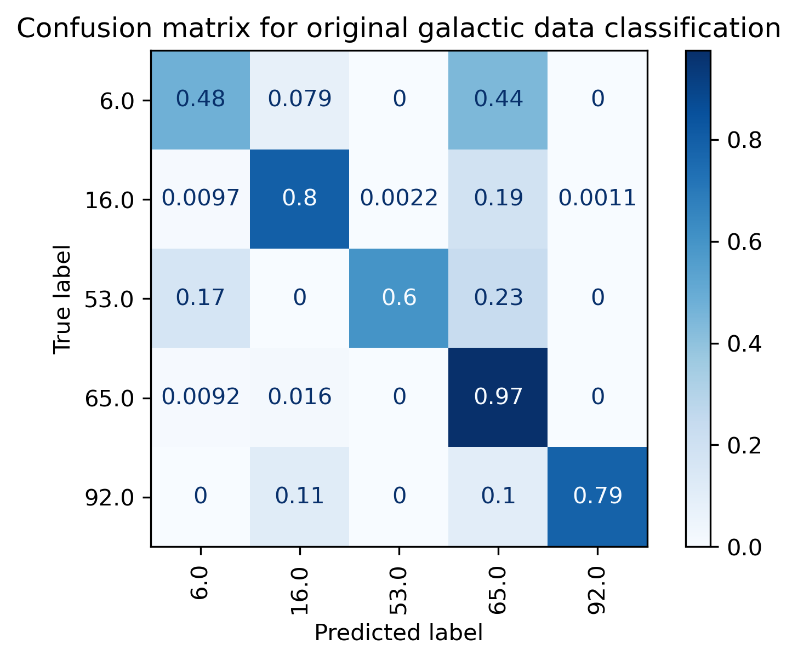{#id .class width=300 height=300}  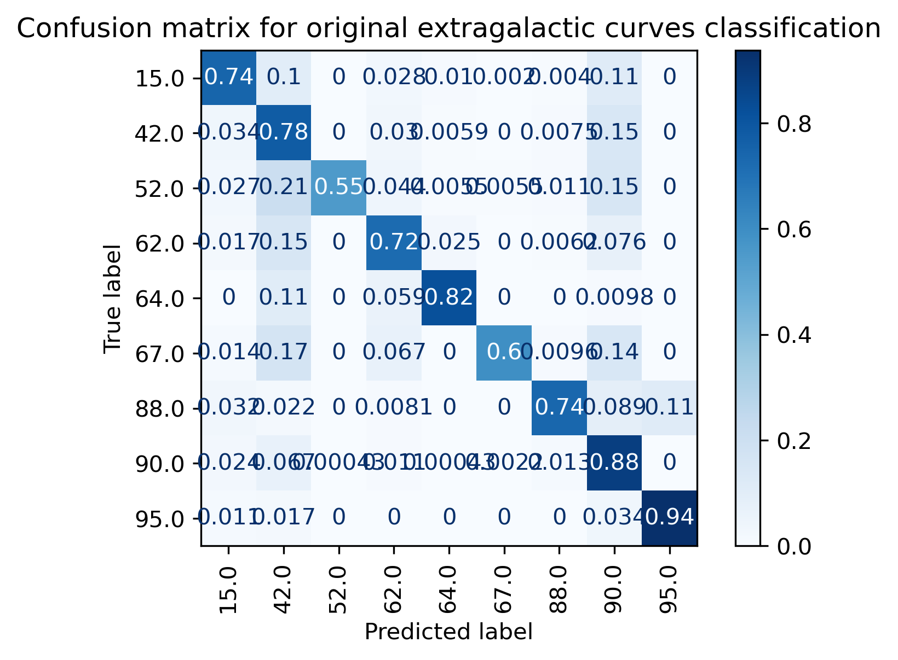{#id .class width=340 height=340}

For class 6,52,53,67, the accuracies are relative low, between 0.48 and 0.6. This can be explained by following facts:

* In total, there is only 30 samples in class 53.
* For the rest, take class 6 as example. We notice about half curves in class 6 are classified to class 65. This is because these two classes have pretty similar pattern thus our features cannot successfully distinguish them. This means more features are needed for better performance. Two light curves from class 6 and 65 are shown below:
```{r eval=FALSE,echo=FALSE}
index = which(train_meta_data$target==6)[1]
object = as.integer(train_meta_data$object_id[index])
object = train_data[which(as.integer(train_data$object_id)==as.integer(object)),]
p1 = object%>% ggplot() + geom_point(aes(x=mjd,y=flux,color=passband),size=2) + geom_line(aes(x=mjd,y=flux,color=passband),size=1,alpha=0.2)
#################
index = which(train_meta_data$target==65)[1]
object = as.integer(train_meta_data$object_id[index])
object = train_data[which(as.integer(train_data$object_id)==as.integer(object)),]
object %>% ggplot() + geom_point(aes(x=mjd,y=flux,color=passband),size=2) + geom_line(aes(x=mjd,y=flux,color=passband),size=1,alpha=0.2)


figure <- ggarrange(p1, p2, labels = 
                      c("A source in class 6", "A source in class 65"),
                    ncol = 2, nrow = 1)
figure
ggsave("./Images/img_bad_predictions.png",width = 10,height=5)
```


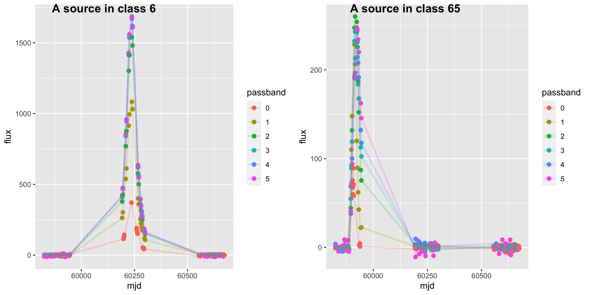{#id .class width=1000 height=300}


